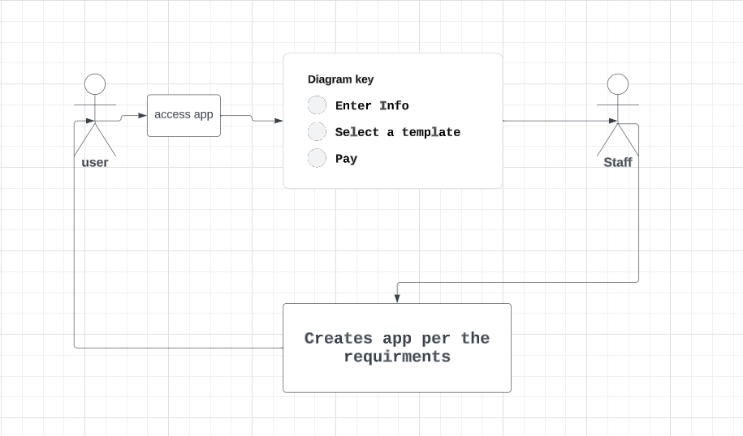

# Ask for Portfolio

## Description
- An app that allows users to submit a form to request a portfolio.
- When the user click on get started, the user is presented with a form to fill out containing the following inputs:
    - Name
    - Email
    - Phone Number
    - Message
- then the user is directed to a page with all the portfolio templates available.
- When the user clicks on a template, the user is directed to a page with the template and the user's information filled out.
- Then the user is directed to a page with a page to pay for the portfolio via Stripe.
- When the user clicks on the pay button, the user is directed to a page with a receipt for the payment and a link to download the portfolio.
- Then our team will take the request and create the portfolio and send it to the user.

## why we are building this app
- We are building this app to help students and professionals to have a professional portfolio to showcase their work and skills.
- Instead of spending time and money to build a portfolio, the user can fill out a form and pay for the portfolio and get it in a few days.

## Diagram

## form 
https://docs.google.com/forms/d/e/1FAIpQLScP1Om-g3ADgQWhX1lHoi8z2i-fm7AIo5Sfs2PRvIQGeaEtGQ/viewform?usp=sf_link